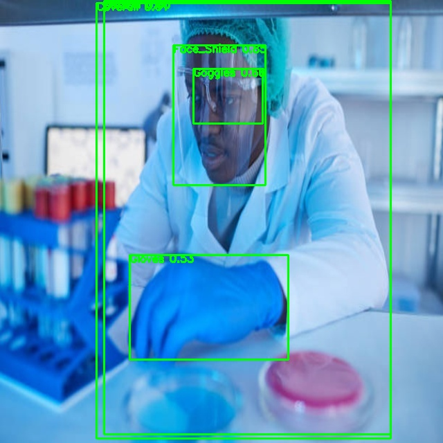
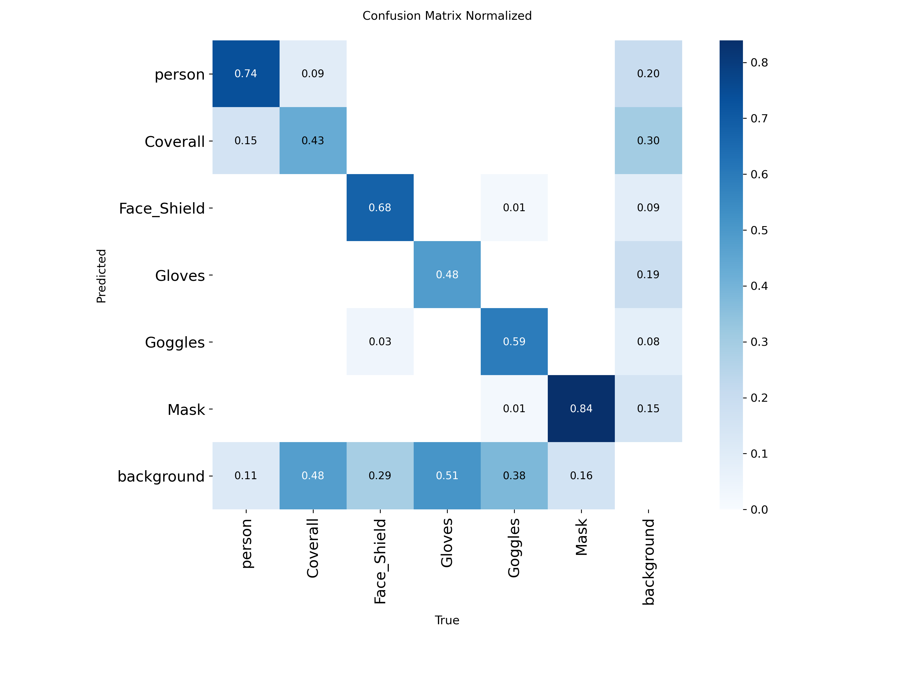

# 🛡️ VisionGuard

An AI-powered **Face Recognition Attendance** and **PPE (Personal Protective Equipment) Compliance Monitoring System** for workplace safety and productivity.

> Built with Flask, Streamlit, MySQL, YOLOv5, and InsightFace (ArcFace).  
> Real-time camera integration with role-based access and admin dashboard.

---

## 📸 Features

### ✅ Attendance Management
- Face Recognition using ArcFace (InsightFace)
- Live camera-based check-in
- Real-time attendance marking
- Role-based login: Admin, HR, Employee

### 🧑‍🔧 PPE Detection
- Detects presence of:
  - Face Mask 😷
  - Safety Goggles 🥽
  - Face Shield 🛡️
  - Coveralls 🧥
  - Gloves 🧤
- YOLOv5-based object detection
- Frame-wise PPE summary for each person

### 📊 Admin Dashboard
- View attendance logs
- Run real-time camera for attendance or PPE check
- Manage users, roles, and export data

---

## 🗂️ Project Structure

<pre lang="markdown"><code>
📂 VisionGuard/
├── 🧠 backend/ → Flask API with MySQL (role-based auth, attendance)
├── 🎨 frontend/ → Streamlit UI dashboard (admin, HR, employee)
├── 🧬 embeddings/ → ArcFace-based face embeddings & SVM classifier
├── 🦺 PPE_DETECTION/ → YOLOv5 PPE detection (mask, gloves, coverall, etc.)
├── 📦 models/ → Trained model.onnx (tracked via Git LFS)
├── 🧪 test/ → Video/image test scripts & aligned face datasets
└── 📄 README.md → Project documentation
 </code></pre>
---

## 🔐 Sample Login Credentials

| Role       | Username | Password   |
|------------|----------|------------|
| 👑 Admin    | `admin`  | `admin123` |
| 👤 Employee | `sonal`  | `sonal123` |

Use these credentials to log In.

---

## 🖼️ Demo

### 1. Project Link
[Open VisionGuard Project](https://mainpy-3xe65g4xzu78hjtvszlcoa.streamlit.app/)

### 2. PPE Detection and Metrics

<div align="center">
<table>
<tr>
<td>

</td>
<td style="padding-left: 30px;">

</td>
</tr>
</table>
</div>


## 🚀 Quick Start

### 1. Clone the repo

```bash
git clone https://github.com/Nobodyyisme/VisionGuard.git
cd VisionGuard

python -m venv vision_env
source vision_env/bin/activate  # or vision_env\Scripts\activate on Windows
pip install -r requirements.txt

cd backend
python app.py

cd frontend
streamlit run main.py

# Extract aligned face images from video
python extract_frames.py --video ./raw_videos/test.mp4

# Run PPE detection on webcam
cd PPE_DETECTION
python detect.py --source 0


# Generate face embeddings
cd embeddings
python generate_embeddings.py

